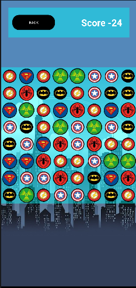
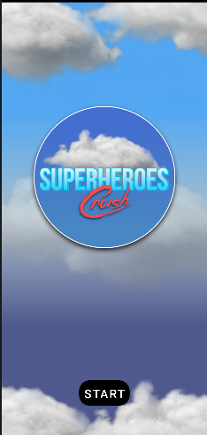

# SuperheroesCrush – Android Arcade Game

SuperheroesCrush is a fast-paced Android arcade game designed to provide fun and engaging gameplay through dynamic tap-based mechanics.

---

## 🎮 Gameplay Overview

Players interact with superheroes in a fast reaction-based environment.  
The goal is to score as many points as possible while progressing through levels.

---

## 📱 Features

- Score tracking system
- Level-based progression
- Smooth animations
- Clean UI/UX design
- Optimized performance
- Lightweight architecture

---

## 🛠 Tech Stack

- Java
- Android SDK
- XML Layouts
- Gradle Build System

---

## 📦 Download

Download the latest release here:

🔗 [Download APK](https://github.com/arakel-programs/SuperheroesCrush/releases/download/v1.0.0/app-release.apk)

---

## 🚀 Installation

1. Download the APK.
2. Enable installation from unknown sources.
3. Install and start playing.

---

## 📌 Status

Stable release – v1.0.0  
Maintained as part of Android development portfolio.

---
## Screenshots

Developed by **Gor Arakelyan**
